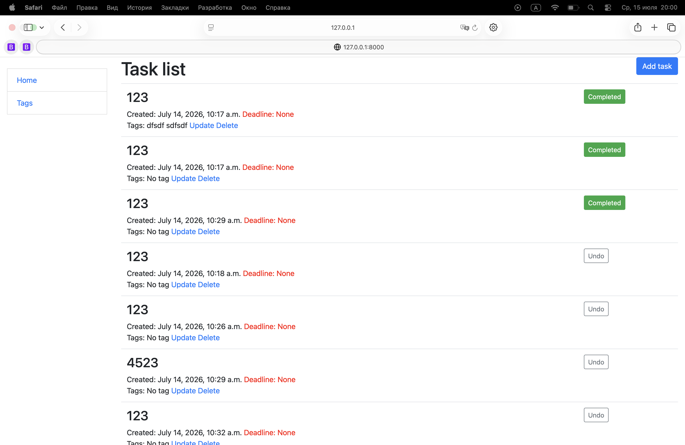

# todo_list
A simple todo list for planning tasks and tracking deadlines

## link to the project in Github
https://github.com/spmspi/todo_list.git

## Shell
* git clone https://github.com/spmspi/todo_list.git
* cd todo_list
* python3 -m venv venv
* source venv/bin/activate
* pip install -r requirements.txt
* python manage.py runserver

## Features

* Ability to create, delete and update tasks
* Ability to create, delete and update tags
* Tracking task creation time and deadlines
* You can change the task status: сompleted or not

## Demo
